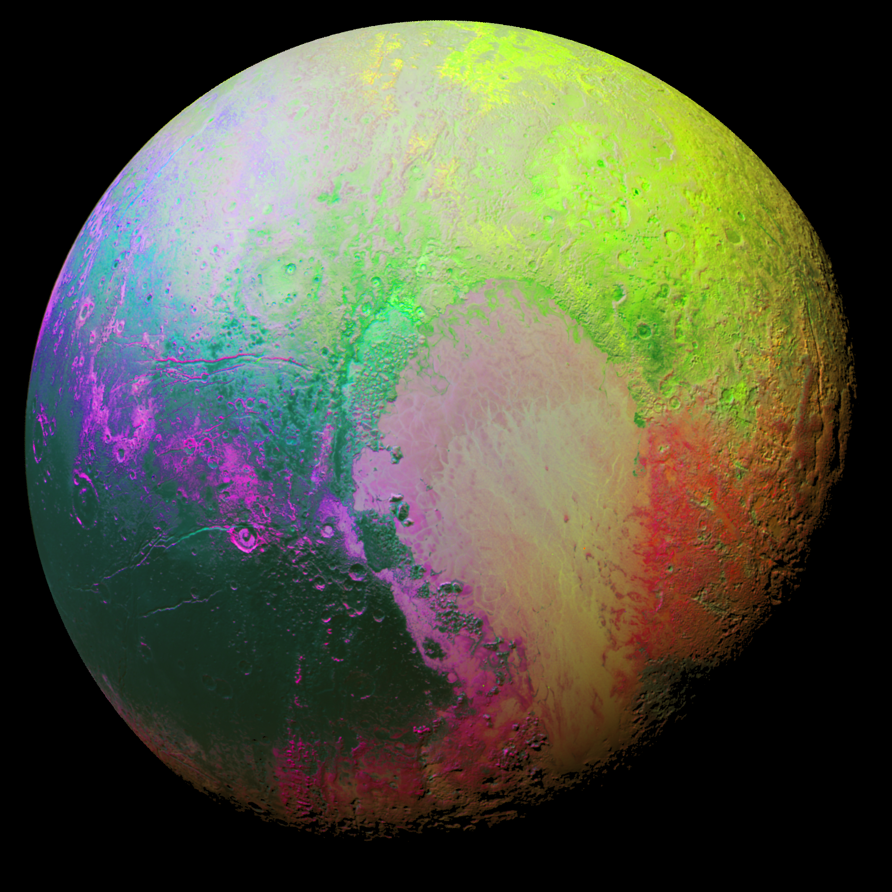

Android | iOS | Windows
--- | :---: | ---:
~~Medium app for Android~~ | **Medium app for iOS** | _Medium app for Win_
asiduaisu di aisdji asidjaisjd iajsdijasidja isdj asdokaos dksdkdksda| djgijriwjeo eidfjso dij dsofijs d asidiajsdijasi djai sd| sodifjsdoifjoIDJOASIJDISDJF
[Play Store](https://play.google.com/store) | [AppStore](http://appstore.com/)|[just some link! LOL](https://google.com)
 |  | 
 |  |

I'm going to **talk gibberish** here, this is just to demonstrate _markdown_.

We can of course write a quote block:
> You said "The weather was **_fine_** today!"

~~Check out also the tildas!~~

# This is header 1

## This is a header 2 instead

###### Why not giving a shot at a header 6

##### Well, this is header 5 indeed

To write unordered list items use -, +, * interchangeably:

- This is the first element
- This is another element
   - sub list
      - sub sub list
   - sub list
   - sub list
+ here's an element
- well...another one again
- element element
* asterisk element
   + sub list item
   - sub list item again
+ plus again

If you want to write numbered lists, instead:
1. First item of an ordered list
   1. sub-list example (for sub-lists, add 3 spaces!)
   1. sub-list example 2
   1. sub-list example 3
2. lists are beautiful!
3. the number does not really matter but it's better sticking to it
12938. hey hey...

**But there is another type of list which is quite interesting**, especially when keeping track of something:
+ [ ] task1
+ [ ] task2
+ [ ] task3
